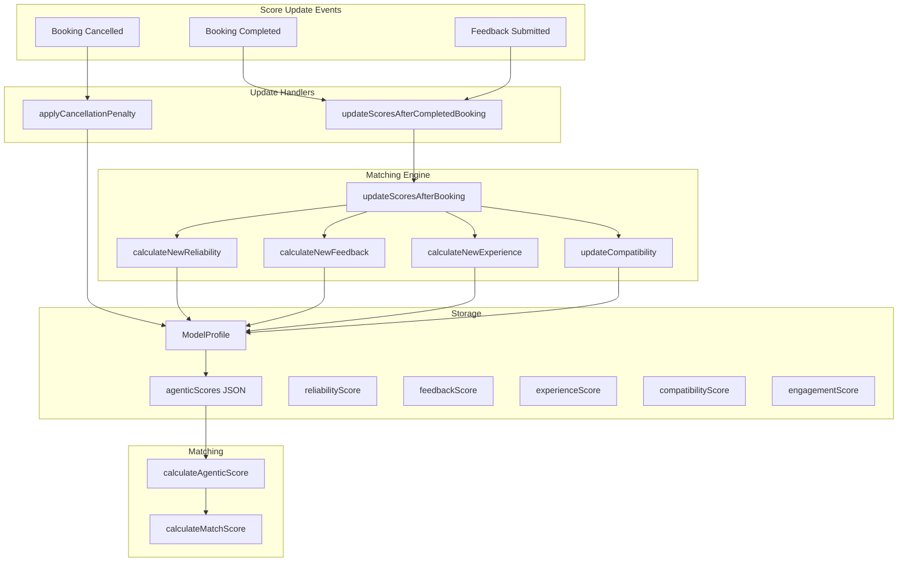

# Agentic Scoring — Comprehensive Logic, Process, Mapping & Technicals

This document describes the full agentic scoring system: reliability, feedback, experience, engagement, and compatibility. Use it as the reference for improvements.

---

## 1. Overview

### 1.1 Role in Match Score

The **final match score** (0–100) is composed of:

| Component | Weight | Description |
|----------|--------|-------------|
| Attribute Match | 40% | Physical attributes (hair, skin, etc.) |
| **Agentic Learning** | **35%** | Behavior, feedback, experience |
| Location | 15% | Distance/travel time |
| Availability | 10% | Schedule alignment |

### 1.2 Agentic Sub-Scores (Internal Weights)

Within the 35% agentic block, each sub-score has a base weight:

| Sub-Score | Base Weight | Service-Adjusted? |
|-----------|-------------|-------------------|
| Reliability | 20% | Yes (agenticMultipliers) |
| Feedback | 25% | Yes |
| Experience | 15% | Yes |
| Engagement | 15% | Yes |
| Compatibility | 25% | Yes |

**Formula:**  
`agenticTotal = Σ (modelScore[type] × baseWeight[type] × serviceMultiplier[type]) / Σ (baseWeight × serviceMultiplier)`  
Then normalized to 0–100.

---

## 2. Data Flow & Architecture



---

## 3. Reliability Score (0–100)

### 3.1 Config ([`matchingEngine.js`](src/matching/matchingEngine.js) AGENTIC_SCORES.reliability)

| Factor | Weight | Description |
|--------|--------|--------------|
| showUpRate | 35% | Attends scheduled appointments |
| onTimeRate | 25% | Arrives within grace period |
| cancellationPenalty | 20% | Last-minute cancellations (negative) |
| responseTime | 10% | Response time to booking requests |
| instructionFollowing | 10% | Follows pre-appointment prep |

**Special rules:**
- `minBookingsRequired: 3` — below 3 bookings, reliability is forced to 50 (neutral)
- `decayRate: 0.05` — 5% decay per month of inactivity (defined but not implemented in `updateScoresAfterBooking`)

### 3.2 Update Logic ([`matchingEngine.js`](src/matching/matchingEngine.js) `calculateNewReliability`)

**Trigger:** `updateScoresAfterCompletedBooking` when a booking is marked completed.

**Input:** `booking` with `modelShowedUp`, `onTime`, `responseTimeHours`.

**Formula:**
```
adjustment = 0
if modelShowedUp:  adjustment += 5
else:              adjustment += -20   (no-show)

if modelShowedUp:
  if onTime:       adjustment += 3
  else:            adjustment += -5

if responseTimeHours < 2:   adjustment += 2
elif responseTimeHours > 24: adjustment -= 3

weight = min(1, totalBookings / 10)   # New users change faster
newScore = currentScore * weight + (currentScore + adjustment) * (1 - weight)
return clamp(0, 100, round(newScore))
```

**Gap:** `updateScoresAfterCompletedBooking` always passes `modelShowedUp: true`, `onTime: true`. No-shows are handled via cancellation flow, not completion.

### 3.3 Cancellation Penalty ([`agenticScores.js`](src/utils/agenticScores.js) `applyCancellationPenalty`)

**Trigger:** `bookingService.cancelBooking` when a booking is cancelled.

**Penalties:**
| Scenario | Penalty |
|----------|---------|
| No-show | -20 |
| Model cancelled | -10 |
| Professional cancelled | -5 |

**Formula:** `newScore = max(0, min(100, current - penalty))`

---

## 4. Feedback Score (0–100)

### 4.1 Config (AGENTIC_SCORES.feedback)

| Factor | Weight | Scale |
|--------|--------|-------|
| overallRating | 30% | 1–5 stars |
| cooperation | 20% | 1–5 |
| communication | 15% | 1–5 |
| professionalism | 15% | 1–5 |
| photoQuality | 10% | 1–5 or inferred |
| wouldBookAgain | 10% | Y/N → 100 or 0 |

**Special:** `recencyBias: 0.7` — recent feedback weighted 70% more.

### 4.2 Update Logic (`calculateNewFeedback`)

**Trigger:** When `feedback` is provided with `updateScoresAfterCompletedBooking`.

**Input:** `feedback` object:
```javascript
{
  overallRating,   // 1-5
  cooperation,     // 1-5
  communication,   // 1-5
  professionalism, // 1-5
  photoQuality,    // 1-5 (or fallback to overallRating)
  wouldBookAgain   // boolean
}
```

**Formula:**
```
feedbackScore = (overallRating/5)*100*0.30 + (cooperation/5)*100*0.20 +
                (communication/5)*100*0.15 + (professionalism/5)*100*0.15 +
                (photoQuality/5)*100*0.10 + (wouldBookAgain ? 100 : 0)*0.10

if totalFeedbacks === 0:
  return round(feedbackScore)
else:
  return round(feedbackScore * 0.7 + currentScore * 0.3)
```

### 4.3 Data Source

- **Schema:** `Booking.professionalFeedback` (JSON)
- **Flow:** Professional submits feedback when completing a booking → `bookingService.completeBooking` → `updateScoresAfterCompletedBooking(booking, feedback.professionalFeedback)`

### 4.4 Alternative Calculator ([`agenticScoreCalculator.js`](src/utils/agenticScoreCalculator.js))

`calculateFeedbackScore` uses a different approach:
- Recency: `isRecent = index < length/2` → weight 1.7 vs 1.0
- `photoQuality`: derived from `feedback.afterPhotos.length > 0` (100 vs 50)
- `wouldBookAgain`: `=== true` or `=== 'yes'` → 100, else 50

**Note:** This calculator is not wired into the live update flow; it’s used for batch/recompute (e.g. `updateAgenticScoresInDatabase`).

---

## 5. Experience Score (0–100)

### 5.1 Config (AGENTIC_SCORES.experience)

| Factor | Weight | Description |
|--------|--------|-------------|
| totalBookings | 40% | Tier-based |
| serviceVariety | 25% | Different service types |
| monthsOnPlatform | 20% | Account age |
| repeatBookings | 15% | Same pro booked again |

**Booking tiers:**
| Bookings | Score | Label |
|----------|-------|-------|
| 0–2 | 20 | New |
| 3–5 | 40 | Getting Started |
| 6–10 | 60 | Experienced |
| 11–20 | 80 | Veteran |
| 21+ | 100 | Elite |

### 5.2 Update Logic (`calculateNewExperience`)

**Trigger:** Every completed booking.

**Input:** `model` with `totalBookings`, `servicesCompleted`, `monthsOnPlatform`, `repeatBookings`.

**Formula:**
```
bookingScore = tier score from totalBookings (20/40/60/80/100)
varietyScore = min(100, serviceVariety * 20)
tenureScore  = min(100, monthsOnPlatform * 10)
repeatScore  = min(100, repeatBookings * 15)

return round(bookingScore*0.40 + varietyScore*0.25 + tenureScore*0.20 + repeatScore*0.15)
```

### 5.3 Data Sources

- `totalBookings`: count of completed bookings (from DB in `agenticScores.js`)
- `servicesCompleted`: array of service types (from `modelProfile.servicesCompleted`)
- `monthsOnPlatform`: from `modelProfile.monthsOnPlatform`
- `repeatBookings`: from `modelProfile.repeatBookings`

**Gap:** `agenticScores.js` does not compute or pass `servicesCompleted`, `repeatBookings`; it uses whatever is on the profile. These may not be updated when bookings complete.

---

## 6. Engagement Score (0–100)

### 6.1 Config (AGENTIC_SCORES.engagement)

| Factor | Weight | Description |
|--------|--------|-------------|
| profileCompleteness | 25% | Profile fields filled |
| photoCount | 20% | Number of quality photos |
| photoRecency | 15% | How recent are photos |
| responseRate | 20% | Response rate to opportunities |
| lastActive | 10% | Days since last activity |
| quizCompletion | 10% | Fun quizzes (future) |

### 6.2 Update Logic

**No live update in `updateScoresAfterBooking`.** Engagement is not updated on booking completion.

**Alternative:** `agenticScoreCalculator.calculateEngagementScore` computes it from:
- Profile fields: `firstName`, `lastName`, `email`, `phone`, `locationZip`, hair attrs, `somethingFun`, etc.
- `photoUrls.length` (capped at 6 for 100%)
- Response rate from matches (accepted/declined vs total)
- `lastActive` (if present)

**Gap:** Engagement is never written by the completion/cancellation flow. It would need to be updated on profile change, photo upload, or match response.

---

## 7. Compatibility Score (0–100)

### 7.1 Config (AGENTIC_SCORES.compatibility)

| Factor | Weight | Description |
|--------|--------|-------------|
| sameServiceSuccess | 35% | Success rate for this service type |
| sameProfessionalHistory | 20% | Previously worked with this pro |
| similarProSuccess | 15% | Success with similar experience level pros |
| timeSlotPreference | 15% | Requested time matches availability |
| locationConvenience | 15% | Distance/travel considerations |

### 7.2 Update Logic (`updateCompatibility`)

**Trigger:** Every completed booking.

**Input:** `model` with `serviceHistory`, `booking` with `serviceId`, `wasSuccessful`.

**Formula:**
```
serviceHistory[serviceId].total += 1
if wasSuccessful: serviceHistory[serviceId].successes += 1

serviceSuccessRate = (successes / total) * 100
return round(currentScore * 0.6 + serviceSuccessRate * 0.4)
```

**Gap:** `serviceHistory` is not persisted. `agenticScores.js` passes `model.serviceHistory` from the profile, but `updateCompatibility` returns a new score without returning updated `serviceHistory`. The DB update does not store `serviceHistory`, so the next booking loses this state.

---

## 8. Service-Specific Multipliers

Each service type can scale agentic sub-scores. Example (`SERVICE_WEIGHTS`):

| Service | Reliability | Feedback | Experience | Engagement | Compatibility |
|---------|-------------|----------|------------|------------|---------------|
| haircut | 1.0 | 1.0 | 0.8 | 0.8 | 1.0 |
| color | 1.2 | 1.0 | 1.2 | 0.8 | 1.2 |
| highlights | 1.3 | 1.1 | 1.0 | 0.9 | 1.1 |
| keratin | 1.4 | 1.2 | 1.3 | 0.8 | 1.2 |
| bridal_makeup | 1.5 | 1.3 | 1.2 | 0.9 | 1.3 |
| blowdry | 0.9 | 1.0 | 0.7 | 1.0 | 0.9 |
| nails | 0.9 | 1.0 | 0.6 | 1.0 | 0.9 |

---

## 9. Schema & Storage

### 9.1 ModelProfile Fields ([`amplify/data/resource.ts`](amplify/data/resource.ts))

| Field | Type | Purpose |
|-------|------|---------|
| reliabilityScore | float | Legacy/backup |
| feedbackScore | float | Legacy/backup |
| experienceScore | float | Legacy/backup |
| engagementScore | float | Legacy/backup |
| compatibilityScore | float | Legacy/backup |
| agenticScores | json | `{ reliability, feedback, experience, engagement, compatibility }` |

### 9.2 Booking.professionalFeedback (JSON)

Expected shape:
```javascript
{
  overallRating: number,    // 1-5
  cooperation: number,      // 1-5
  communication: number,    // 1-5
  professionalism: number,  // 1-5
  photoQuality: number,     // 1-5
  wouldBookAgain: boolean
}
```

---

## 10. File Reference

| File | Purpose |
|------|---------|
| [`src/matching/matchingEngine.js`](src/matching/matchingEngine.js) | AGENTIC_SCORES config, calculateAgenticScore, updateScoresAfterBooking, calculateNew* |
| [`src/utils/agenticScores.js`](src/utils/agenticScores.js) | updateScoresAfterCompletedBooking, applyCancellationPenalty |
| [`src/utils/agenticScoreCalculator.js`](src/utils/agenticScoreCalculator.js) | Batch calculation from bookings/matches (not in live flow) |
| [`src/utils/bookingService.js`](src/utils/bookingService.js) | Calls updateScoresAfterCompletedBooking on complete, applyCancellationPenalty on cancel |
| [`src/matching/MATCHING_ENGINE_SPEC.md`](src/matching/MATCHING_ENGINE_SPEC.md) | High-level spec |

---

## 11. Gaps & Improvement Opportunities

1. **Reliability:** No-shows on completed bookings not distinguished; `modelShowedUp`/`onTime` always true in completion path.
2. **Reliability decay:** 5% per month inactivity not implemented.
3. **Experience:** `servicesCompleted`, `repeatBookings` not updated when bookings complete.
4. **Engagement:** Never updated by event handlers; only via batch calculator.
5. **Compatibility:** `serviceHistory` not persisted; compatibility resets across sessions.
6. **Feedback recency:** `calculateNewFeedback` uses fixed 70/30; `agenticScoreCalculator` uses index-based recency.
7. **Batch vs live:** Two implementations — `matchingEngine` (live) vs `agenticScoreCalculator` (batch); behavior can diverge.
8. **professionalFeedback UI:** Ensure completion flow collects all 6 factors in the expected format.
9. **updateBookingStatus('no_show'):** Does not trigger `applyCancellationPenalty`; no-show via status update bypasses agentic updates entirely.

---

## 12. Prioritized Improvement Plan (Reviewed)

This section integrates a reviewed improvement plan with codebase validation.

### 12.1 Severity Classification (Validated)

| Severity | Issue | Codebase Validation |
|----------|-------|---------------------|
| **Broken** | Reliability completion path always `modelShowedUp: true` | Confirmed: [`agenticScores.js`](src/utils/agenticScores.js) line 57 hardcodes `modelShowedUp: true` |
| **Broken** | Compatibility `serviceHistory` not persisted | Confirmed: `updateCompatibility` returns only score; `serviceHistory` not in ModelProfile schema; never written |
| **Broken** | Two divergent implementations | Confirmed: `matchingEngine` vs `agenticScoreCalculator` have different formulas |
| **Broken** | `updateBookingStatus(bookingId, 'no_show')` bypasses agentic | Confirmed: [`bookingService.js`](src/utils/bookingService.js) `updateBookingStatus` only updates status, no agentic call |
| **Incomplete** | Reliability decay never runs | Confirmed: No Lambda or cron |
| **Incomplete** | Engagement never updated | Confirmed: Not in `updateScoresAfterBooking` |
| **Incomplete** | Experience fields not updated | Confirmed: `servicesCompleted`, `repeatBookings` not in schema; agenticScores reads from profile but nothing writes |

### 12.2 Priority 1: Fix Broken (Week 1–2)

#### 1A — Reliability: Separate Completion from No-Show

**Validation:** The diagnostic is correct. `completeBooking` and no-show are mutually exclusive today (complete → completion flow; no-show → `cancelBooking` with reason). However:

- **Caveat:** `updateBookingStatus(bookingId, 'no_show')` exists and does not call `applyCancellationPenalty`. Either wire it to call the penalty, or deprecate it in favor of `cancelBooking(bookingId, 'model', 'no-show')`.
- **Fix:** Add explicit `attended` and `onTime` to `completeBooking` payload; require them in `updateScoresAfterCompletedBooking`. Defaulting to `true` hides professional error (e.g. marking completed by mistake when model no-showed).

**Recommended API:**
```javascript
completeBooking(bookingId, { attended: true, onTime: true, feedback: {...} })
// Or split: completeBookingAttended(bookingId, feedback) / completeBookingNoShow(bookingId)
```

#### 1B — Compatibility: Persist serviceHistory

**Validation:** Correct. `updateCompatibility` mutates `model.serviceHistory` in memory but returns only the score. Schema has no `serviceHistory` field.

**Fix:**
1. Add `serviceHistory: a.json()` to ModelProfile in [`amplify/data/resource.ts`](amplify/data/resource.ts).
2. Change `updateCompatibility` to return `{ score, serviceHistory }`.
3. In `agenticScores.js`, persist `serviceHistory` in the ModelProfile update.
4. Change `updateScoresAfterBooking` to return `serviceHistory` from the compatibility update.

**Highest ROI** — compatibility is currently noise; this makes it meaningful.

#### 1C — Unify Live and Batch Implementations

**Validation:** Correct. `agenticScoreCalculator` reimplements logic; formulas differ (e.g. feedback recency, experience bonuses).

**Fix:** Batch path should replay booking history through `updateScoresAfterBooking` (or equivalent core functions). Refactor `updateScoresAfterBooking` to accept a "previous state" and return "new state" so it can be chained.

**Caveat:** `agenticScoreCalculator` computes from raw bookings; `updateScoresAfterBooking` expects a model object. The batch path would need to hydrate model from profile + bookings, then replay. Ensure `updateScoresAfterBooking` is stateless enough to be replayed (it is, except for `serviceHistory` which we're persisting).

### 12.3 Priority 2: Wire Missing Events (Week 3–4)

#### 2A — Reliability Decay (EventBridge Monthly)

**Fix:** New Lambda `agentic-decay`; EventBridge cron (e.g. 1st of month). Requires `lastActiveDate` on ModelProfile — add to schema and wire:
- Cognito PostAuthentication trigger
- Match response handler
- Booking completion

#### 2B — Engagement: Wire Triggers

**Fix:** Three triggers:
1. **Profile/photo update** — AppSync mutation or Lambda; call `calculateEngagementScore` and persist.
2. **Match response** — When model accepts/declines; update `lastActiveDate` and optionally recalc engagement.
3. **Login** — Cognito PostAuthentication; update `lastActiveDate`.

#### 2C — Experience: Update servicesCompleted and repeatBookings

**Fix:** Add `servicesCompleted`, `repeatBookings` to ModelProfile schema. In `updateScoresAfterCompletedBooking`:
- Append `booking.serviceType` to `servicesCompleted` if not present.
- Query/count bookings with same `professionalId` for this model → `repeatBookings`.
- Persist both in the update.

### 12.4 Priority 3: Structural Improvements (Week 5–6)

#### 3A — Feedback Sub-Scores: Hair Model Reality

**Recommended schema:**
```javascript
{
  overallRating: 1-5,    // 35% — "Would you work with this model again?"
  hairAccuracy: 1-5,     // 30% — "Did hair match description/photos?"
  professionalism: 1-5, // 20% — "Professional and easy to work with?"
  punctuality: 1-5,      // 15% — Cross-validates reliability
}
```

**Migration:** Add `hairAccuracy`, `punctuality`; deprecate `cooperation`, `communication`, `photoQuality` (or map legacy to new). Update `calculateNewFeedback` weights.

#### 3B — Reliability Formula: Sensitivity Fix

**Current (too dampening for new models):**
```javascript
weight = min(1, totalBookings / 10)
newScore = currentScore * weight + (currentScore + adjustment) * (1 - weight)
```

**Proposed:**
```javascript
const sensitivity = Math.max(0.3, 1 - (totalBookings / 20));
newScore = clamp(0, 100, currentScore + (adjustment * sensitivity));
```

New models get full penalty; veterans get dampened. Valid improvement.

#### 3C — Compatibility: Rebooking and Professional Decline

**Add:**
- `rebookingCount` (integer) — when same pro books same model again.
- `professionalDeclines` (integer) — when pro explicitly declines a match suggestion.
- `applyRebooking`: +10 to compatibility.
- `applyProfessionalDecline`: -4 to compatibility.

Requires new events: "pro rebooked model" and "pro declined match" — need to identify where these occur in the flow.

### 12.5 Additional Fix: updateBookingStatus('no_show')

**Issue:** `updateBookingStatus(bookingId, 'no_show')` does not trigger agentic updates.

**Fix (choose one):**
- **Option A:** In `updateBookingStatus`, when `status === 'no_show'`, call `applyCancellationPenalty(booking, 'model', true)`.
- **Option B:** Deprecate direct status updates for no-show; require `cancelBooking(bookingId, 'model', 'no-show')` so one path handles it.

### 12.6 Recommended Build Order

| Week | Focus | Items |
|------|-------|-------|
| 1–2 | Fix broken | 1A attended/onTime, 1B serviceHistory persist, 1C unify implementations, updateBookingStatus no-show |
| 3–4 | Wire events | 2A decay + lastActiveDate, 2B engagement triggers, 2C experience fields |
| 5–6 | Structural | 3A feedback schema, 3B reliability sensitivity, 3C rebooking/decline signals |
| 7+ | Polish | Per-service compatibility, admin breakdown UI, feedback volume confidence |
