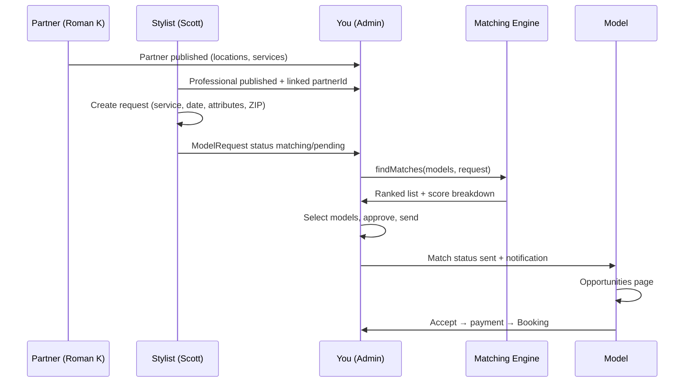

# End-to-end flow: Salon → Stylist → Request → You → Matches → Models

**Purpose:** Single reference for how Modeled should run from partner onboarding through model acceptance. Use this to walk through Roman K Salon + Scott Waldman (or the mock Sarah → Seraphina path today).

---

## Who does what (operating model)

| Role | What they do | Where |
|------|----------------|-------|
| **Partner (salon)** | Onboards business, locations, services; may view roster & bookings later | Partner portal `/partner-portal/*` |
| **Professional (stylist)** | Submits a **model request** (service, date, ideal hair, location) | Pro portal `/portal/matching/create` |
| **You (admin)** | Reviews request → runs matching engine → approves scores → **sends** to models | Admin `/admin/requests`, `/admin/match-approval` |
| **Model** | Sees opportunity → accepts/declines → pays → booking confirmed | Model portal `/model-portal/opportunities` |

**Important:** Stylists do **not** pick models directly. They request **with you**; you run the engine and control who receives an opportunity.

---

## Status lifecycles

### ModelRequest (the stylist’s ask)

```
pending → matching → matched → booked → completed
              ↘ cancelled
```

| Status | Meaning |
|--------|---------|
| `pending` | Submitted; waiting for your review |
| `matching` | Approved for matching; in your queue |
| `matched` | You sent opportunities to one or more models |
| `booked` | A model accepted and booking exists |
| `completed` | Service done |

### Match (one model × one request)

```
pending → approved → sent → accepted | declined | expired | waitlist
```

| Status | Meaning |
|--------|---------|
| `pending` | Created by engine (or auto-matching Lambda when wired) |
| `approved` | You approved this model for this request |
| `sent` | Notification delivered; model can see opportunity |
| `accepted` | Model accepted → booking flow |
| `declined` / `waitlist` / `expired` | Standard exit paths |

---

## Flow diagram



---

## Matching methodology (how scores work)

Engine: `src/matching/matchingEngine.js`

**Launch weights**

| Component | Weight | What it measures |
|-----------|--------|------------------|
| **Attribute fit** | 72% | Hair length, color, texture, condition, virgin hair, open-to-service flags |
| **Reachability** | 28% | ZIP/borough distance, travel time, availability vs request slot |
| **Agentic learning** | 0% (launch) | Reliability, feedback, etc. — computed but not ranked yet |

**Hard filters (model excluded if)**

- Dealbreaker on attribute (e.g. allergies vs color service)
- Not open to requested service (`openToHaircut`, `openToColor`, …)
- `cardOnFileStatus` not `valid` (default blocks most profiles)
- Below `minScore` (default 30)

**Your review step:** Admin pages show `finalScore` + `scoreBreakdown` so you can override judgment before send.

**After bookings:** `src/utils/agenticScores.js` updates model scores for future runs when agentic weight &gt; 0.

---

## Admin walkthrough (your path)

### 1. Entities in the system

1. **Publish Roman K** — `/admin/salons` → Roman K draft → Publish  
2. **Publish Scott** — `/admin/professionals` → Scott Waldman → Publish (links `partnerId` when partner exists)  
3. **Link Scott to Cognito** — `Professional.userId` = Scott’s login sub (required for pro portal requests in his name)

### 2. Stylist creates request (with you in the loop)

**Option A — Scott in pro portal**

- Scott logs in → `/portal/matching/create`  
- Fills: service (e.g. haircut), date/time, desired hair attributes, location (Flatiron / ZIP 10016)  
- Submit → `ModelRequest` with `professionalId` = Scott’s id, `status: matching`

**Option B — You create for Scott (common early on)**

- `/admin/requests` → **Create Request** → select Scott’s professional → same fields  
- Good when Scott isn’t on Cognito yet

### 3. You run matches

- `/admin/match-approval` (or `/admin/matching`)  
- Select Scott’s request  
- Engine runs client-side: `findMatches(approvedModels, request)`  
- Review scores; check breakdown (hair, location, availability)  
- Select models → **Send opportunities**

Behind the scenes:

1. `createMatchesForRequest` → `Match` rows (`pending`)  
2. `approveMatches` → `approved`  
3. `sendMatchesToModels` → `sent` + `createNotification`  
4. `ModelRequest.status` → `matched`

### 4. Model receives & accepts

- Model → `/model-portal/opportunities`  
- Sees card with score, service, date  
- Accept → payment → `Booking` created

### 5. Pro sees outcome

- `/portal/matching` or match viewing — confirmed once model accepts

---

## Demo today (fully wired in mock)

If Roman K / Scott aren’t published yet:

1. `VITE_USE_MOCK_DATA=true` in `.env.local`  
2. Pro: Sarah Mitchell (`mock-pro-1`) — create request  
3. Admin: `/admin/match-approval` → select request → pick **Seraphina** (`mock-model-1`) → Send  
4. Model: `/model-portal/opportunities` as Seraphina  

See `docs/WORKFLOW_MATCH_TO_MODEL.md` for localStorage alignment.

---

## Gaps blocking production E2E (fix order)

| Priority | Gap | Fix |
|----------|-----|-----|
| **P0** | Roman K + Scott only drafts | Publish partner + pro; link Scott `userId` |
| **P0** | `ModelRequest.status: 'sent'` invalid in DB | Use `matched` (fixed in admin send handlers) |
| **P1** | Models cannot read `Match` (Admin-only auth) | Add model read rule (e.g. by `modelId` / custom claim) |
| **P1** | `cardOnFileStatus: valid` filters out real models | Set test models valid for walkthrough, or admin toggle “include without card” |
| **P1** | Notifications console-only in mock | Persist `Notification` + model inbox UI |
| **P2** | Pro portal falls back to Sarah if Scott not found | Ensure Scott `Professional` by `userId` |
| **P2** | Auto-matching Lambda not wired | `backend.ts` DynamoDB stream → `auto-matching` (optional; you stay manual) |
| **P3** | Agentic weight 0 | Re-enable when enough booking history |

---

## How stylists should “request with you” (product copy)

Recommended UX messaging for pros:

1. **Submit a model request** in the pro portal (service + date + ideal look).  
2. **Modeled reviews** and runs the match engine (24–48h or your SLA).  
3. **You approve** which models receive an opportunity — quality control stays with you.  
4. **Models opt in**; first to accept and complete payment holds the slot.  
5. **You and the pro** get notified when booked.

Optional later: pro sees **suggested** matches read-only; only admin can send.

---

## Key files

| Step | File |
|------|------|
| Pro create request | `src/portal/pages/ProRequestCreationLuxury.jsx`, `src/utils/requestService.js` |
| Admin queue | `src/admin/pages/RequestsPage.jsx` |
| Admin match + send | `src/admin/pages/MatchApprovalPage.jsx`, `src/admin/pages/MatchEnginePage.jsx` |
| Scoring | `src/matching/matchingEngine.js` |
| Match lifecycle | `src/utils/matchService.js` |
| Model inbox | `src/portal/model-pages/ModelOpportunities.jsx` |
| Schema | `amplify/data/resource.ts` |

---

## Next build recommendation

1. **This week:** Publish Roman K + Scott; run one real request from admin for Scott; send to 2–3 test models with `cardOnFileStatus: valid` and NYC ZIPs.  
2. **Next:** Fix `Match` + `Notification` auth so models see opportunities without mock mode.  
3. **Then:** Pro portal “request submitted — awaiting Modeled review” state + admin SLA queue on `/admin/requests`.
