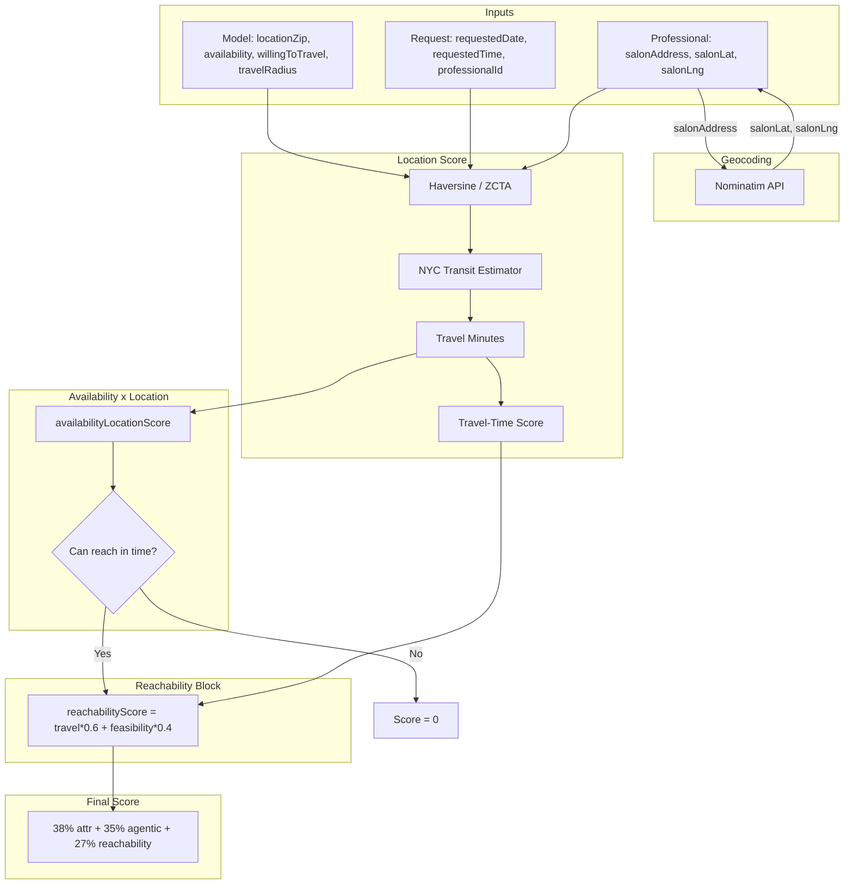

# Phase A: Geocoding & Reachability — Summary

## Completed Work

### 1. Geocode on Professional Profile Edit
- **Files:** `src/portal/pages/PortalProfile.jsx`, `src/utils/profileService.js`
- **Flow:** When professional saves profile with `salonAddress`, geocode via Nominatim before save. Block save if geocode fails. Persist `salonLat`, `salonLng`, `locationZip`.
- **Impact:** Salon coordinates stay current when professionals change address; travel-time matching stays accurate.

### 2. Backfill Script for Existing Professionals
- **File:** `scripts/backfillProfessionalGeocoding.js`
- **Run:** `npm run backfill:geocode` (with `npx ampx sandbox` running)
- **Flow:** Lists professionals with `salonAddress` but no `salonLat`/`salonLng`; geocodes each with 1 req/sec rate limit; updates records.
- **Impact:** Existing professionals get coordinates without manual re-entry.

### 3. Availability × Location Triangulation (Dealbreaker)
- **File:** `src/matching/matchingEngine.js`
- **Function:** `availabilityLocationScore(model, request, travelMinutes)`
- **Logic:** `latestDeparture = appointmentTime - travelMinutes - 15`. If no availability slot allows departure by then → return 0 (dealbreaker).
- **Impact:** Models who cannot physically reach the salon in time are excluded (score 0, reason: "Model cannot reach salon in time").

### 4. Reachability Block Merge
- **File:** `src/matching/matchingEngine.js`
- **Change:** Merged location (15%) + availability (10%) into single Reachability block (27%).
- **Formula:** `reachabilityScore = travelScore × 0.6 + feasibilityScore × 0.4`
- **Weights:** Attribute 38%, Agentic 35%, Reachability 27%.
- **UI:** MatchApprovalPage and MatchEnginePage show "Reach" with travel minutes/miles.

---

## AWS Tools Leveraged

| Tool | Usage | Cost |
|------|-------|------|
| **Amplify Data (AppSync + DynamoDB)** | Professional CRUD, ModelProfile, Match, Booking | Pay-per-request (existing) |
| **None (Phase A)** | Geocoding uses Nominatim (OpenStreetMap) — external free API | **$0** |

Phase A uses no new AWS services. Geocoding is Nominatim (free). Data storage is existing Amplify/AppSync.

---

## Costs

| Component | Cost |
|-----------|------|
| Nominatim geocoding | **$0** (free, 1 req/sec) |
| Profile edit geocode | **$0** (client-side fetch) |
| Backfill script | **$0** (runs locally, uses Nominatim) |
| Matching engine changes | **$0** (compute in Lambda/edge, same as before) |
| **Phase A total** | **$0** |

---

## Matchmaking Algorithm Impact

### Before Phase A
- Location: 15% (mile-based or travel-time when salon coords available)
- Availability: 10% (calendar alignment only)
- No "can model get there in time?" check

### After Phase A
- **Reachability: 27%** = 60% travel + 40% feasibility
- **Dealbreaker:** If model cannot reach salon by appointment time (with 15 min buffer), match score = 0
- **Weights:** Attribute 38%, Agentic 35%, Reachability 27%

### Workflow Diagram

---

## Matchmaking Algorithm (Post-Phase A)

1. **Attribute Match (38%):** Hair, skin, services, etc. Dealbreakers: allergies, service not offered.
2. **Agentic (35%):** Reliability, feedback, experience, engagement, compatibility.
3. **Reachability (27%):**
   - **Travel (60% of block):** Distance/travel-time score. Same ZIP=100; travel-time bands when salon coords available; mile fallback otherwise.
   - **Feasibility (40% of block):** When travel minutes known, check if model can reach salon in time. If not → dealbreaker. If yes → buffer score (55–100).
4. **Final:** `finalScore = 0.38×attr + 0.35×agentic + 0.27×reachability`. Threshold 50 = match, 75 = strong, 90 = perfect.
