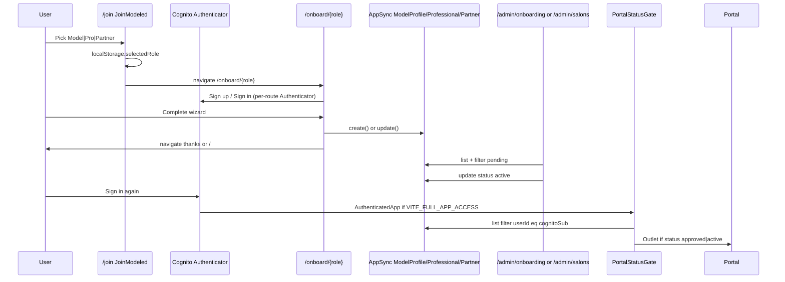

# MODELED — Technical Audit Pack: Join → Onboard → Profile Create → Admin → Portal

**Purpose:** Pure code audit. Copy this entire file to Claude / auditor.  
**Repo:** `modeled-frontend` · Amplify Gen2 · Cognito · AppSync · DynamoDB  
**Generated from live source** — verify line numbers if code changed.

---

## 1. END-TO-END SEQUENCE



---

## 2. ROUTE TABLE (App.jsx)

| Path | Component | Auth wrapper |
|------|-----------|--------------|
| `/join` | `JoinModeled` | Public |
| `/join?role=model` | auto-redirect | Public |
| `/onboard/model` | `ModelOnboard` | `<Authenticator>` |
| `/onboard/professional` | `ProfessionalOnboard` | `<Authenticator>` |
| `/onboard/partner` | `PartnerOnboard` | `<Authenticator>` |
| `/waitlist/model` | `ModelWaitlist` | `<Authenticator>` |
| `/thanks` | `WaitlistThanks` | Public |
| `/model-portal/*` | `ModelPortalLayout` | `/*` → Authenticator → `AuthenticatedApp` |
| `/portal/*` | `ProPortalLayout` | same |
| `/partner-portal/*` | `PartnerPortalLayout` | same |
| `/admin/*` | `AdminLayout` | `ProtectedRoute allowedGroups=['Admin']` |

**Beta gate (`AuthenticatedApp`):** If `VITE_FULL_APP_ACCESS !== 'true'` AND user not Cognito `Admin` → `PrivateBetaLaunch` (no portals).

---

## 3. JOIN — `src/pages/JoinModeled.jsx` (FULL)

```javascript
const handleRoleSelect = (role) => {
  localStorage.setItem('selectedRole', role);
  const intendedRoute = localStorage.getItem('intendedRoute');
  if (intendedRoute) {
    localStorage.removeItem('intendedRoute');
    const intendedRole = intendedRoute.split('/').pop();
    if (intendedRole === role) {
      navigate(intendedRoute);
    } else {
      navigate(`/onboard/${role}`);
    }
  } else {
    navigate(`/onboard/${role}`);
  }
};

// Deep link: /join?role=model|professional|partner
useEffect(() => {
  const roleParam = searchParams.get('role');
  if (roleParam && ['model', 'professional', 'partner'].includes(roleParam)) {
    handleRoleSelect(roleParam);
  }
}, [searchParams]);
```

**Role IDs:** `model`, `professional`, `partner` (must match onboard paths).

---

## 4. USER ID — THE CRITICAL JOIN KEY

### Correct helper — `src/utils/authUtils.js`

```javascript
export function getAuthenticatorUserId(user) {
  if (!user) return null;
  return user.userId || user.username || user.userSub || null;
}
```

### Who uses it CORRECTLY
- `ModelOnboard.jsx` submit → `getAuthenticatorUserId(user)`
- `PortalStatusGate.jsx` → `getAuthenticatorUserId(user)`
- `ModelProfile.jsx` portal load → `filter: { userId: { eq: authUserId } }`

### Who uses it WRONG (email fallback)
```javascript
// BUG PATTERN — loginId is EMAIL not Cognito sub:
const userId = user?.userId || user?.username || user?.signInDetails?.loginId;
```
**Files with bug:** `ProfessionalOnboard.jsx`, `PartnerOnboard.jsx`, all `waitlist/*.jsx`

**Audit impact:** Profile saves but portal lookup by `userId` returns empty → wrong portal / pending forever.

---

## 5. STATUS NORMALIZATION

### Deployed API guard — `src/utils/deployedApiEnums.js`

```javascript
export const DEPLOYED_PROFILE_STATUSES = new Set(['pending', 'approved', 'active', 'inactive']);

export function normalizeDeployedProfileStatus(status, defaultStatus = 'pending') {
  if (status && DEPLOYED_PROFILE_STATUSES.has(status)) return status;
  if (status === 'manual_review' || status === 'needs_changes') return defaultStatus;
  if (status === 'rejected') return 'inactive';
  return defaultStatus;
}
```

### Admin queue filter — `src/admin/utils/approvalStatus.js`

```javascript
export const REVIEW_QUEUE_STATUSES = ['pending_review', 'manual_review', 'needs_changes'];

export function normalizeApprovalStatus(status) {
  const value = String(status || '').toLowerCase();
  if (!value) return 'pending_review';
  if (value === 'pending') return 'pending_review';
  if (value === 'active') return 'approved';  // active = NOT in queue
  return value;
}

export function needsAdminReview(status) {
  return REVIEW_QUEUE_STATUSES.includes(normalizeApprovalStatus(status));
}

export function identityNeedsReview(identityStatus) {
  const v = String(identityStatus || '').toLowerCase();
  return !v || v === 'pending' || v === 'manual_review' || v === 'failed';
}
```

**Queue shows row if:** `needsAdminReview(status)` OR `identityNeedsReview(identityVerificationStatus)`

**Model dev bug:** submit uses `import.meta.env.DEV ? 'active' : 'pending'` → **dev submissions skip review queue**.

---

## 6. MODEL ONBOARD — `src/pages/ModelOnboard.jsx`

### Role guard

```javascript
useEffect(() => {
  const selectedRole = localStorage.getItem('selectedRole');
  if (selectedRole !== 'model') {
    localStorage.setItem('intendedRoute', '/onboard/model');
    navigate('/join');
  }
}, [navigate]);
```

### Steps (10)

1. Basic Info  
2. Modeling path (`everyday` | `editorial` | `both`)  
3. Service Preferences  
4. Availability (≥1 day/time)  
5. Photos (≥3)  
6. Data Privacy & Terms  
7. Review  
8. Email Verification (UI only — submit check commented out)  
9. Phone Verification (UI only — submit check commented out)  
10. Identity Verification (optional unless `VITE_REQUIRE_ONBOARD_IDENTITY=true`)

### Submit core — `handleSubmit`

```javascript
if (shouldUseMockData()) {
  alert('Set VITE_USE_MOCK_DATA=false...');
  return;
}
const userId = getAuthenticatorUserId(user);

const openFlags = mapServicePreferencesToOpenFlags(formData.servicePreferences);
const profileStatus = normalizeDeployedProfileStatus(
  import.meta.env.DEV ? 'active' : 'pending',
  'pending'
);

const profileData = {
  userId,
  email: formData.email || user?.signInDetails?.loginId || '',
  firstName, lastName, phone, locationZip,
  photoUrls, headshotUrl,
  status: profileStatus,
  photoAnalysisStatus: 'pending',
  ...openFlags,
  identityVerificationStatus: resolvedIdentityStatus, // manual_review if skip
  favoriteService: JSON.stringify({ preferences, modelingFocus, socials, ... }),
  communityInterestsOther: JSON.stringify({ availabilityByDay }),
  termsAccepted, termsAcceptedAt,
};

// Upsert: same userId + same name/email → update, else create
const { data: existing } = await client.models.ModelProfile.list({
  filter: { userId: { eq: userId } }, limit: 1,
});
if (existingProfile && isSameIdentity) {
  await client.models.ModelProfile.update({ id: existingProfile.id, ...profileData });
} else {
  await client.models.ModelProfile.create(profileData);
}

navigate('/thanks?role=model&applied=1');
```

### Service prefs → schema flags — `src/utils/modelOnboardPayload.js`

```javascript
export function mapServicePreferencesToOpenFlags(servicePreferences = []) {
  const set = new Set(servicePreferences);
  const hair = [...set].some((p) => String(p).startsWith('hair_'));
  return {
    openToHaircut: hair && (set.has('hair_cut') || set.has('hair_braids') || ...),
    openToColor: set.has('hair_color') || set.has('hair_transformation') || ...,
    openToStyling: set.has('hair_style') || ...,
    openToMakeup: set.has('beauty_makeup'),
    openToNails: set.has('beauty_nails'),
    openToSkincare: set.has('beauty_skin') || set.has('beauty_injectables'),
  };
}
```

---

## 7. PROFESSIONAL ONBOARD — `src/pages/ProfessionalOnboard.jsx`

### Role guard: same pattern, `selectedRole !== 'professional'`

### Steps (11)

Basic Info → Education → Workplace → Get to Know You → Portfolio → Data Privacy → Terms → Review → Email → Phone → Verification

### Submit core

```javascript
const userId = user?.userId || user?.username || user?.signInDetails?.loginId; // BUG

// Requires: license, 6+ labeled portfolio photos, geocoded salon address
if (salonLat == null || salonLng == null) {
  const coords = await geocodeAddress(salonAddress);
  if (!coords) { alert('...'); return; }
}

const professionalData = {
  userId,
  email, firstName, lastName, phone,
  experienceLevel: schoolStatus === 'in_school' ? 'student' : (years >= 5 ? 'senior' : ...),
  salonName, salonStreet, salonCity, salonState, salonAddress, salonLat, salonLng, locationZip,
  portfolioItems, portfolioUrls, selfPhotoUrls,
  signatureService, serviceWantToTry, workValues: communityInterests,
  identityVerificationStatus: resolvedProfessionalIdentityStatus,
  status: 'pending',
};

const result = await client.models.Professional.create(professionalData);

// localStorage mirror LOCAL_PRO_SUBMISSIONS_KEY for admin fallback
localStorage.setItem(LOCAL_PRO_SUBMISSIONS_KEY, JSON.stringify(deduped));

navigate('/');  // NOT /thanks
```

**Note:** Imports `shouldUseMockData` but **never blocks submit**.

---

## 8. PARTNER ONBOARD — `src/pages/PartnerOnboard.jsx`

**No `selectedRole` guard.**

```javascript
const userId = user?.userId || user?.username || user?.signInDetails?.loginId; // BUG

const partnerData = {
  userId,
  email, businessName, contactName, phone,
  website, city, state, zip,
  somethingFun: message,
  termsAccepted: true,
  status: 'pending',
  identityVerificationStatus: 'pending',
  // servicesList, photos, etc. all null
};

await client.models.Partner.create(partnerData);
navigate('/');
```

**Admin path:** `/admin/salons` (NOT `/admin/onboarding`).

---

## 9. WAITLIST (alternate path) — `src/pages/waitlist/ModelWaitlist.jsx`

```javascript
const userId = user?.userId || user?.username || user?.signInDetails?.loginId; // BUG

const payload = {
  userId, email, firstName, lastName, phone, locationZip: zip,
  howDidYouHear, somethingFun: whyInterested,
  termsAccepted: true, termsAcceptedAt: now,
  status: 'pending',
  adminNotes: 'waitlist_signup',
};
// upsert ModelProfile
navigate('/thanks?role=model');
```

`/join` does **not** route to waitlist — only full onboard.

---

## 10. ADMIN REVIEW — `src/admin/pages/OnboardingPage.jsx`

```javascript
const [modelRes, proRes] = await Promise.all([
  client.models.ModelProfile.list({ limit: 200 }),
  client.models.Professional.list({ limit: 200 }),
]);
// NO Partner.list

const modelRows = modelRes.data
  .map(mapModelRow)
  .filter((r) => needsAdminReview(r.status) || identityNeedsReview(r.identityStatus));

const updateStatus = async (row, nextStatus) => {
  if (row.type === 'model') {
    await client.models.ModelProfile.update({ id: row.id, status: nextStatus });
  } else if (row.type === 'professional') {
    await client.models.Professional.update({ id: row.id, status: nextStatus });
  }
};
// Approve button passes nextStatus = 'active'
```

**Partner approve:** `SalonsPage.jsx` → `client.models.Partner.update({ id, status: nextStatus })`

---

## 11. PORTAL GATE — `src/components/PortalStatusGate.jsx`

```javascript
const ALLOWED_STATUSES = ['approved', 'active'];
const userId = getAuthenticatorUserId(user);

// Bypass: demo mode, mock data, import.meta.env.DEV → status = 'active'

const filter = { filter: { userId: { eq: userId } }, limit: 1 };
const [modelRes, proRes, partnerRes] = await Promise.all([
  ModelProfile.list(filter),
  Professional.list(filter),
  Partner.list(filter),
]);
setStatus(data[0].status || 'pending');

if (ALLOWED_STATUSES.includes(status)) {
  return children || <Outlet />;
}
// else: pending review screen
```

---

## 12. AUTHENTICATED SHELL — `src/App.jsx` `AuthenticatedApp`

```javascript
const fullAppAccess = import.meta.env.VITE_FULL_APP_ACCESS === 'true';
const { isAdmin: strictAdmin } = useStrictAdmin();

if (!fullAppAccess && !strictAdmin && !allowShellForLocalAdmin) {
  return <PrivateBetaLaunch signOut={signOut} />;
}
// else render /portal, /model-portal, /partner-portal, /admin routes
```

---

## 13. COGNITO — `amplify/auth/resource.ts`

```typescript
groups: ['Model', 'Professional', 'Partner', 'Admin'],
loginWith: { email: true },
userAttributes: { givenName, familyName, phoneNumber, 'custom:userType' },
```

**No post-confirmation Lambda in repo** → groups are **never auto-assigned** on onboard.

---

## 14. SCHEMA AUTH — `amplify/data/resource.ts` (excerpt)

All three profile models:

```typescript
status: a.enum(['pending', 'approved', 'active', 'inactive', 'manual_review', 'needs_changes', 'rejected']),
identityVerificationStatus: a.enum(['pending', 'verified', 'failed', 'manual_review']),
.authorization((allow) => [
  allow.owner(),        // creator's Cognito identity
  allow.group('Admin'),
]),
```

**`userId` field** is application-level string — must equal Cognito sub for portal list filter to work.  
**`allow.owner()`** is separate from `userId` column (Amplify owner field on record).

---

## 15. ENV VARS AFFECTING FLOW

| Variable | Effect |
|----------|--------|
| `VITE_USE_MOCK_DATA=true` | Model submit blocked; admin/portal use mocks |
| `VITE_FULL_APP_ACCESS=true` | Bypass PrivateBetaLaunch |
| `VITE_SKIP_IDENTITY_VERIFICATION=true` | Identity → manual_review on submit |
| `VITE_REQUIRE_ONBOARD_IDENTITY=true` | Block submit without verified/manual_review ID |
| `import.meta.env.DEV` | Model status→active; PortalStatusGate bypass |

---

## 16. AUDIT FINDINGS TABLE (copy for checklist)

| # | Finding | Severity | Location |
|---|---------|----------|----------|
| 1 | Pro/Partner/Waitlist use email as userId | P0 | See §4 |
| 2 | No Cognito group assignment on onboard | P0 | auth/resource.ts |
| 3 | PrivateBetaLaunch without VITE_FULL_APP_ACCESS | P0 | App.jsx |
| 4 | Model DEV submit → active skips admin queue | P1 | ModelOnboard ~2482 |
| 5 | Partner not in OnboardingPage | P1 | OnboardingPage.jsx |
| 6 | Partner no selectedRole guard | P2 | PartnerOnboard.jsx |
| 7 | Pro/Partner navigate `/` not `/thanks` | P2 | submit handlers |
| 8 | Pro no shouldUseMockData guard | P2 | ProfessionalOnboard |
| 9 | Pro requires 6 portfolio + geocode | P2 UX | ProfessionalOnboard |
| 10 | Email/phone verify steps dead code | P3 | ModelOnboard submit |
| 11 | cardOnFileStatus never set in onboard | P3 | matching blocker later |
| 12 | identity manual_review keeps row in queue | P3 | approvalStatus.js |

---

## 17. FILE INDEX (audit these files)

```
src/pages/JoinModeled.jsx
src/pages/ModelOnboard.jsx
src/pages/ProfessionalOnboard.jsx
src/pages/PartnerOnboard.jsx
src/pages/waitlist/ModelWaitlist.jsx
src/pages/waitlist/ProfessionalWaitlist.jsx
src/pages/waitlist/PartnerWaitlist.jsx
src/pages/waitlist/WaitlistThanks.jsx
src/utils/authUtils.js
src/utils/deployedApiEnums.js
src/utils/modelOnboardPayload.js
src/utils/mockDataService.js
src/components/PortalStatusGate.jsx
src/components/PrivateBetaLaunch.jsx
src/components/IdentityVerification.jsx
src/App.jsx
src/admin/pages/OnboardingPage.jsx
src/admin/pages/SalonsPage.jsx
src/admin/utils/approvalStatus.js
src/portal/model-pages/ModelProfile.jsx
amplify/auth/resource.ts
amplify/data/resource.ts (ModelProfile, Professional, Partner)
```

---

## 18. MANUAL E2E PROOF SCRIPT

```text
Prereq: VITE_USE_MOCK_DATA=false, VITE_FULL_APP_ACCESS=true

MODEL:
  /join?role=model → new Cognito user → 10 steps → submit
  Assert: ModelProfile.userId === session sub (not email)
  /admin/onboarding → row visible (if status pending)
  Approve → active
  /model-portal/profile → correct firstName

PRO:
  /join?role=professional → submit
  Assert: Professional.userId === sub
  /admin/onboarding → row → Approve
  /portal/profile → loads

PARTNER:
  /join?role=partner → submit
  /admin/salons → pending → Approve
  /partner-portal → loads
```

---

*End of technical audit pack.*
